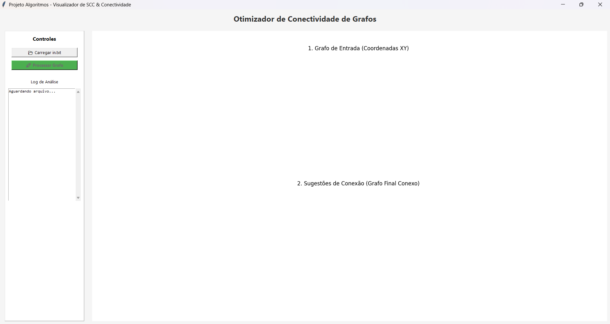
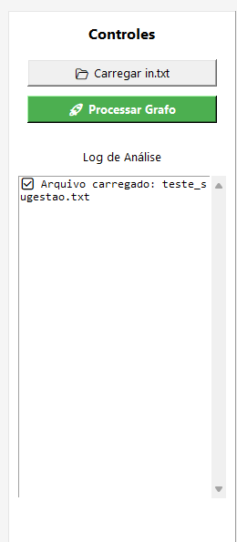
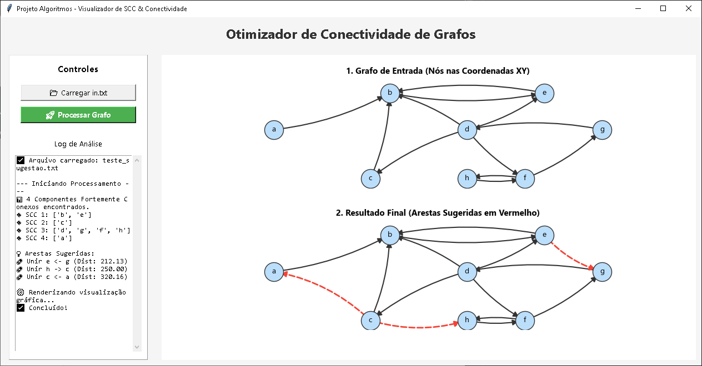

# Otimizador de Grafos Fortemente Conexos

Número da Lista: 35 
Conteúdo da Disciplina: Grafos 

## Apresentação

## Sobre
O Otimizador de Grafos Fortemente Conexos é uma ferramenta desenvolvida para análise e otimização de conectividade em grafos direcionados. O projeto resolve um problema clássico de infraestrutura e logística: como tornar um sistema totalmente acessível com o menor custo de conexão?

Identificação de SCCs: O programa utiliza buscas em profundidade (DFS) e largura (BFS) para isolar os Componentes Fortemente Conexos (SCCs) — "ilhas" onde todos os nós alcançam uns aos outros.

Otimização Geométrica: Utilizando as coordenadas cartesianas $(x, y)$ de cada nó, o algoritmo calcula a Distância Euclidiana entre todos os componentes isolados.

Sugestão de Arestas: O programa identifica os pares de nós mais próximos entre componentes diferentes e sugere a criação de arestas para unificar o grafo, garantindo que ele se torne um único componente fortemente conexo.

## Screenshots

### 1. Interface Inicial
A interface limpa pronta para receber o arquivo de entrada.

### 2. Processamento e Logs
Exemplo do log detalhado identificando cada um dos SCCs e calculando as distâncias.

### 3. Projeto em Funcionamento (Grafo Final)
O resultado visual com as arestas originais e as sugestões de conexão em vermelho.

## Instalação
Linguagem: Python 
Disciplina: Estrutura de Dados 2 
Bibliotecas Necessárias: matplotlib, networkx, tkinter (nativa).

Certifique-se de ter o Python instalado. Em seguida, instale as dependências via terminal:

`pip install matplotlib networkx`

Comando para rodar:

`python gui.py`
ou
`python main.py caminho/ao/grafo.txt`

## Uso

Prepare o arquivo de entrada: Crie um arquivo .txt seguindo o formato:

Nós: NOME COORD_X COORD_Y (Ex: A 100 200)

Arestas: ORIGEM DESTINO (Ex: A B)

Carregue no Programa: Clique em "Carregar in.txt" e selecione seu arquivo.

Processe: Clique em "Processar Grafo".

Visualize: O painel esquerdo exibirá a análise lógica e os SCCs encontrados. O painel direito mostrará o grafo original e, logo abaixo, o grafo otimizado com as novas conexões destacadas em vermelho tracejado.

## Outros

Complexidade Algorítmica:
Identificação de SCCs: $O(V + E)$, utilizando uma estratégia inspirada no algoritmo de Kosaraju.
Conectividade Total: $O(V^2)$ no pior caso para a busca exaustiva de distâncias mínimas entre componentes.

O projeto demonstra como conceitos de teoria de grafos podem ser aplicados em conjunto com geometria analítica para resolver problemas de conectividade em redes e sistemas de comunicação.

## Integrantes da Equipe

|  | Matrícula | Aluno |
| -- | -- | -- |
| 

 | 23/2014450 | [Geovanna Umbelino](https://github.com/GeovannaUmbelino) |
| 

 | 22/1008697 | [Sunamita Vitória](https://github.com/Sunamit) |